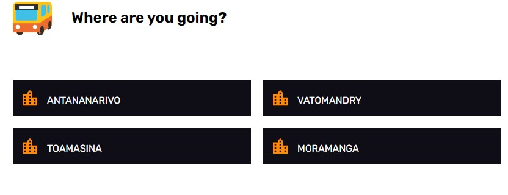
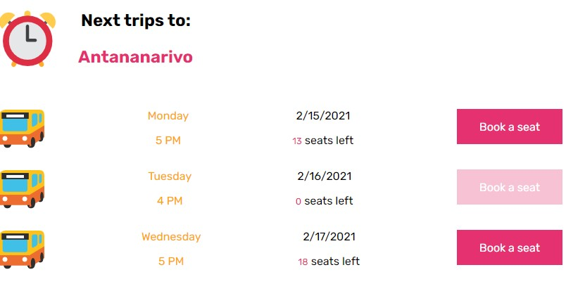
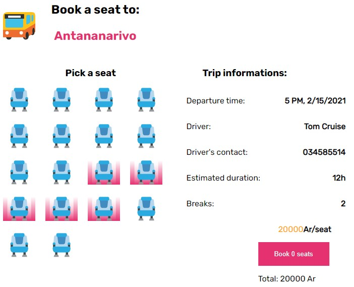
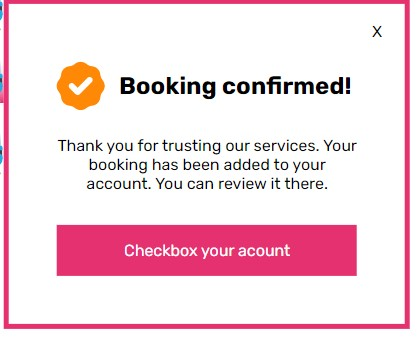

# hit-parade-react

## Table of Contents

-   [Overview](#overview)
    -   [Built With](#built-with)
-   [Features](#features)
-   [How does it work](#how-does-it-work)
-   [How To use](#how-to-use)
-   [Contact](#contact)

<!-- OVERVIEW -->

## Overview






## Built With

-   [React](https://reactjs.org/)
-   [React-Redux](https://react-redux.js.org/)
-   [Styled-components](https://styled-components.com/)


## Features

In this project, I work with html, react, redux and styled-component to create an app for trips in Mahanoro station. There are quite a lot of pages in this project. There is Mahanoro station page which is the home page where you can find a list of cities.

## How does it work

Each city is a link that lead users into another page where you can find more information about the trip. You can find the time when the bus is going to leave and how many seats are still available. There are button in where you click when you want to book some seats. If there is no seat available anymore, the button is disabled and you cannot click on it. Each button is going to lead the users to another page wwhich is the booking page. In this page, you can see how seats are still available, you can peak some seats. There are the driver's information there and also the fare.

In the booking page, you can see a button which tells you how many seats you've booked. Clicking the button will open a modal where you are going to confirm your booking.

In the modal, you can find a button which says check your account. This button leads you to the last page which is the user's page or the My account page, where you can update your userName and your contact, and where you can find how many seats you have booked in a trip. You can cancel an old booking clicking the cancel button.


## How To Use

<!-- Example: -->

To clone and run this application, you'll need [Git](https://git-scm.com) and [Node.js](https://nodejs.org/en/download/) (which comes with [npm](http://npmjs.com)) installed on your computer. From your command line:

```bash
# Clone this repository
$ git clone https://github.com/your-user-name/your-project-name

# Install dependencies
$ npm install

# Run the app
$ npm start
```

## Contact

-   GitHub [@Mickaella](https://github.com/Mickaellah/mahanoro-station)
